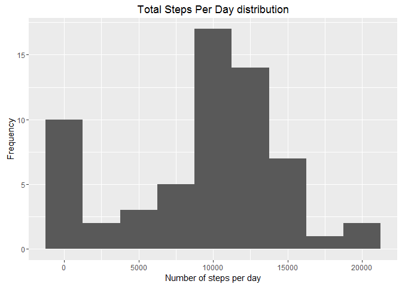
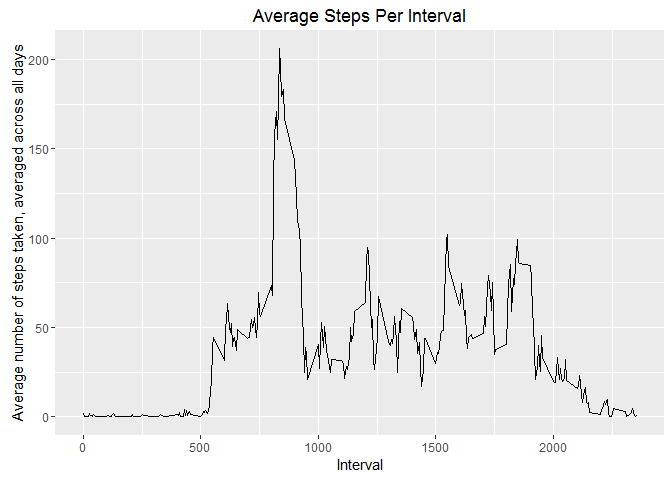
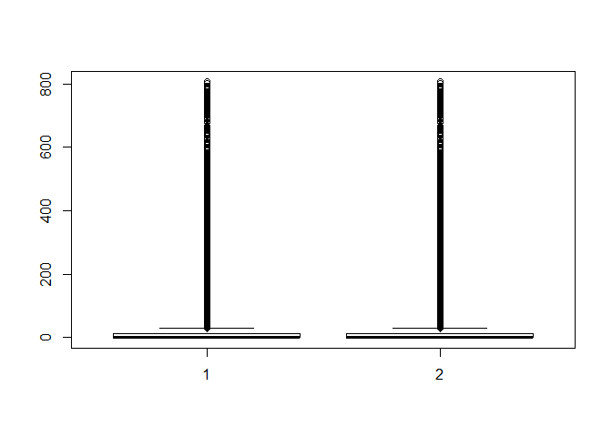
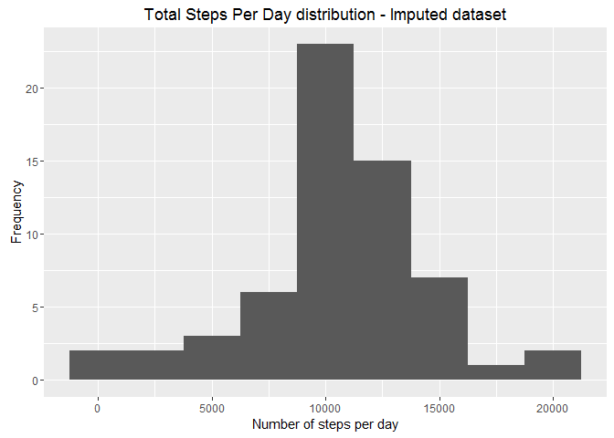
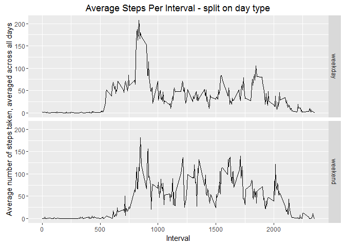

# Reproducible Research: Peer Assessment 1
Georgi Pamukov  
04/09/2016  


## Loading and preprocessing the data

- Load libraries required
- Check if data dir exists and create if necessary
- Download, upack and read the data


```r
library(dplyr)
library(data.table)
library(ggplot2)
library(mice)
library(lubridate)

data_dir <- "./data"
url <- "https://d396qusza40orc.cloudfront.net/repdata%2Fdata%2Factivity.zip"
dest_file <- "project_data.zip"

if(!file.exists(data_dir)){dir.create(data_dir)}
dest_file_full_pth <- file.path(data_dir, dest_file, fsep = .Platform$file.sep)
download.file(url, destfile = dest_file_full_pth, mode = "wb") # download binary

unzip(dest_file_full_pth, files = NULL, list = FALSE, overwrite = TRUE, junkpaths = FALSE, exdir = data_dir, unzip = "internal", setTimes = FALSE)

dt_r <- fread(input = file.path(data_dir, "activity.csv", fsep = .Platform$file.sep), data.table = TRUE)
```

## What is mean total number of steps taken per day?

- Calculates the total number of steps taken per day
- Makes a histogram of the total number of steps taken each day
- Calculates the mean and median of the total number of steps taken per day


```r
tot_steps_day <- dt_r %>% group_by(date) %>% summarize(total_steps = sum(steps, na.rm = TRUE))

ggplot(tot_steps_day, aes(total_steps)) + geom_histogram(binwidth = 2500) + ggtitle("Total Steps Per Day distribution") + xlab("Number of steps per day") + ylab("Frequency")
```

<!-- -->

```r
meas_tot <- tot_steps_day %>% summarize(mean_steps = mean(total_steps, na.rm = TRUE), median_steps = median(total_steps, na.rm = TRUE))
```

- Report the mean and median of the total number of steps taken per day

Mean | Median
------------- | -------------
9354.23 | 10395.00 


## What is the average daily activity pattern?

- Time series plot of the 5-minute interval (x-axis) and the average number of steps taken, averaged across all days (y-axis)


```r
avg_intrv_ptrn_day <- dt_r %>% group_by(interval) %>% summarize(avg_steps = mean(steps, na.rm = TRUE))

ggplot(avg_intrv_ptrn_day, aes(interval, avg_steps)) + geom_line() + ggtitle("Average Steps Per Interval") + xlab("Interval") + ylab("Average number of steps taken, averaged across all days")
```

<!-- -->

```r
max_steps_intrv <- avg_intrv_ptrn_day[which.max(avg_intrv_ptrn_day$avg_steps),1]
```
- 5-minute interval, on average across all the days in the dataset, that contains the maximum number of steps is:
**835**

## Imputing missing values

- Calculates the total number of missing values in the dataset (i.e. the total number of rows with NAs)

```r
missing_val <- sum(is.na(dt_r$steps))
```

- There are **2304** days/intervals where there are missing steps (coded as NA). The presence of missing days may introduce bias into some calculations or summaries of the data.
- Missing values needs to be imputed.
- Considering the big variability in step numbers per different intervals within the same days and the fact that distribution is not exactly normal I have doubts that "mean-based" methods for imputation will provide reliable results.
- I would recommend regression based algorithm like:
    + Estimate linear regression on cases with no missing data (regression of steps on interval) - producing a set of reg coefficients (b).
    + Draw random values (mvrnorm) from multivariate normal distribution with mean b and estimated dispersion (covariance) matrix of b - and attach to new set of coefficients b2 - to provide neceessary "realistic" variability.
    + Using b2 generate "predicted" steps for both missing and present cases.
    + For each missing steps, identify a set of cases with populated steps whose predicted values (based on b2) are closest to the one of the particular case.
    + From among chosen (closest) cases, randomly choose one and assign its **actual** value to imput the particular missing value.
    + This is also known as predictive mean matching - and there are libraries that provides it - like mice.
- Create a new dataset that is equal to the original dataset but with the missing data filled in:


```r
dt_o <- mice(dt_r, m=5, meth='pmm', seed=10)

# imput
dt_i <- complete(dt_o, 1)
```

- Verify all values are imputed and check the quality of the imputation (boxplot):


```r
sum(is.na(dt_i$steps))
```

```
## [1] 0
```

```r
boxplot(dt_r$steps, dt_i$steps)
```

<!-- -->

- Histogram of the total number of steps taken each day - based on the imputed set


```r
tot_steps_day_i <- dt_i %>% group_by(date) %>% summarize(total_steps = sum(steps, na.rm = TRUE))

ggplot(tot_steps_day_i, aes(total_steps)) + geom_histogram(binwidth = 2500) + ggtitle("Total Steps Per Day distribution - Imputed dataset") + xlab("Number of steps per day") + ylab("Frequency")
```

<!-- -->

- Calculate and report the mean and median total number of steps taken per day.

```r
meas_tot_i <- tot_steps_day_i %>% summarize(mean_steps = mean(total_steps, na.rm = TRUE), median_steps = median(total_steps, na.rm = TRUE))
```

- Report the mean and median of the total number of steps taken per day per wa and imputed set

Mean - raw | Median - raw | Mean - imp | Median - imp
------------- | ------------- | ------------- | -------------
9354.23 | 10395.00 | 10729.11 | 10755.00 

- Imputed metrics differ from the estimates from the first part of the assignment.
- Mean have significantly increased its value after the imputation - which is logical - and can be explained with increased total number of steps per day/interval.
- There is a slight change in the Median value. One explanaiton is that missing values were not random in the original set - but deeper investigation should be performed here... 

## Are there differences in activity patterns between weekdays and weekends?

- Create a new factor variable in the dataset with two levels – “weekday” and “weekend” indicating whether a given date is a weekday or weekend day.
- Make a panel plot containing a time series plot of the 5-minute interval (x-axis) and the average number of steps taken, averaged across all weekday days or weekend days (y-axis).


```r
dt_i$wkday_flg <- factor(as.character(weekdays(ymd(dt_i$date)) %in% c('Saturday', 'Sunday')))
levels(dt_i$wkday_flg) = c('weekday','weekend')

avg_intrv_ptrn_da_i <- dt_i %>% group_by(interval, wkday_flg) %>% summarize(avg_steps = mean(steps, na.rm = TRUE))

ggplot(avg_intrv_ptrn_da_i, aes(interval, avg_steps)) + geom_line() + ggtitle("Average Steps Per Interval - split on day type") + xlab("Interval") + ylab("Average number of steps taken, averaged across all days") + facet_grid(wkday_flg ~ .)
```

<!-- -->

- Pattern deffers between weekends and weekdays:
    + There is a big peak in morning activity in weekdays - this is probably jogging/sport
    + Pattern in weekends is more steady -  but overall activity is more - probably all day hiking/walks etc.
    
    
    

